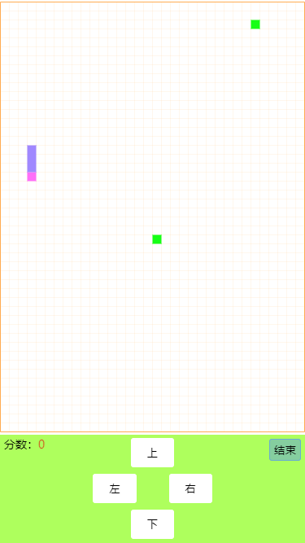

# html5贪吃蛇小游戏（PC端&移动端适配）

> 主逻辑代码只有300行左右（含注释），Canvas绘制，绘制工具采用的是[CreateJS](https://github.com/CreateJS/EaselJS)。

demo地址：[https://gaga-change.github.io/game-snake/](https://gaga-change.github.io/game-snake/)（若打不开或报错提[iesues](https://github.com/gaga-change/game-snake/issues)我会立即修复，或是[PR](https://github.com/gaga-change/game-snake/pulls)）

下载后用浏览器打开`index.html`即可运行！

PC端&移动端适配，皆可玩耍！效果图如下：

